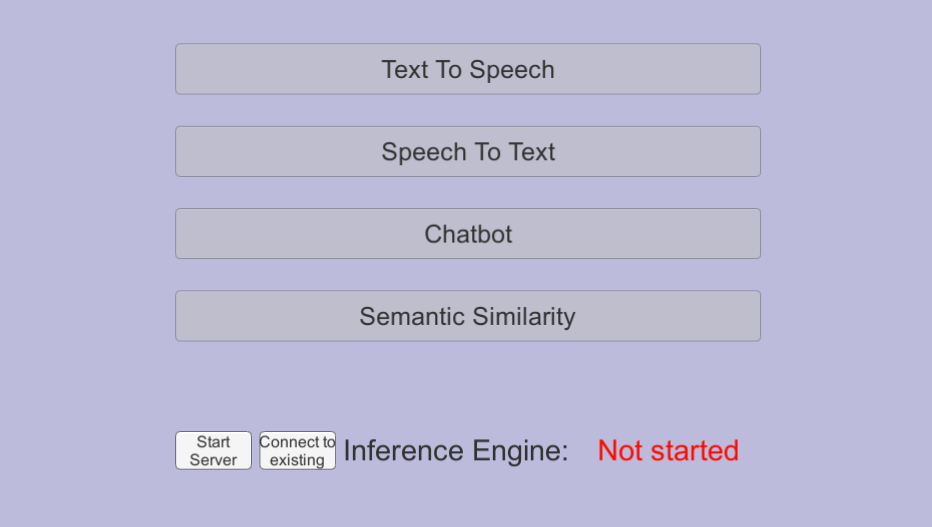
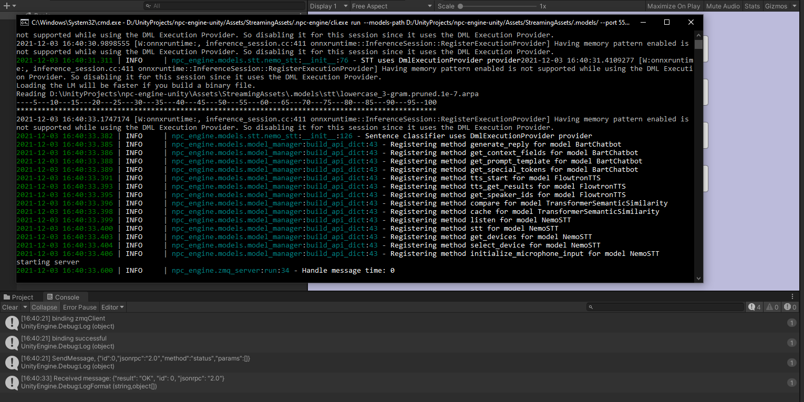
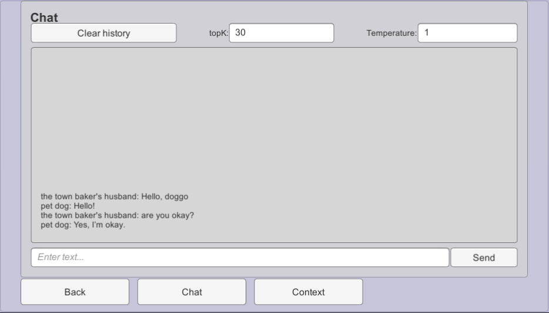
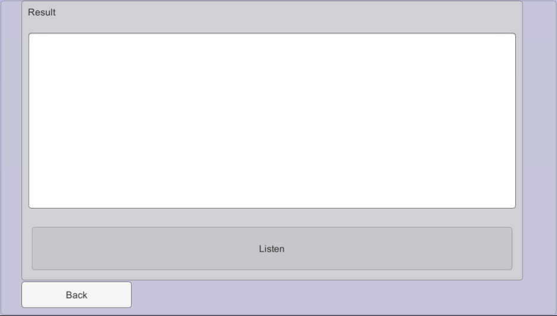

This tutorial explains raw usage of the NPC Engine API from Unity using Basic Demo scene.

## Scene Overview

First lets go through and play around with the basic demo scene.  
Its located under this path: `NPCEngine/Demo/BasicDemo/Basic.unity`

When you start it the first thing you'll see is this screen:


Since NPC Engine is a server that starts alongside unity and it's startup takes some time you can keep it running between playtests and just connect to existing one.  
No server is running so you should start a new one.

When started you should see some Unity logs regarding connecting to the server as well as server console pop up with server logs. This behaviour is debug only and can be turned off by disabling `debug` flag in `NPCEngineManager` game object.


If NPC Engine starts successfully, menu options will become interactable and you will be able to play around with different APIs.

## Available API Demos

### Text To Speech Demo

This demo shows you the API that allows you to generate speech from text with multiple voices.


### Fantasy Chatbot Demo

This demo shows you the chatbot API. It enables you to describe a fantasy character via the chatbot context and chat with your character.

Right now it's available only in the single style (Fantasy) but we are already working on the other chatbot neural networks with diffirent styles as well as tutorials how to train them yourself.

This demo greets you with a context in which you can fill in different descriptions to simulate different situations.


`Chat` button will take you to chat window where you can talk to the character defined in the context.



`Clear history` button will restart the dialogue.


### Semantic Similarity Demo

This demo shows the API to compare two sentences via their meaning.  
When you press `Compute Similarity` the score is shown in range of `[-1,1]`

Where -1 means that phrases are completely unrelated and 1 is that phrases are the same. Usually the most meaningful scores are in the range `[0,1]` 


### Speech To Text Demo

This demo shows you the API that allows you to listen to microphone input and 
transcribe it to text.

Just press `Listen` button and say something into the microphone.  
Note that it will only work in low noise environment and with slow articulate speech.

!!! note "Experimental API"
    This API is very WIP and experimental so it's performance is not yet ready
    for any production usage, you should use 
    [UnityEngine.Windows.Speech.DictationRecognizer](https://docs.unity3d.com/ScriptReference/Windows.Speech.DictationRecognizer.html) instead



## Server Lifetime

The main script that manages NPC Engine server is `NPCEngine.Server.NPCEngineServer`. It is attached to `NPCEngineManager` game object in the scene.

There you can find these public fields:


`Initialize On Start` controls whether NPCEngineServer will run `StartInferenceEngine` and `ConnectToServer` methods in it's `Awake` method.
For the basic demo it's turned off to allow you to start and connect to server manually via UI buttons.

`Debug` flag when turned on, starts server in a CMD window as well as enables `NPCEngineServer` to write message logs to console.
When it's off, server runs in the background with no logs produced.

`Connect To Existing Server` controls whether `NPCEngineServer` should start the server in `StartInferenceEngine` method
and take ownership of the process (check it's health and terminate it `OnDestroy`).
You can use this flag to not wait for NPCEngine to be initialized each playtest and keep connecting to the one that is already started.

## API Deep Dive

Now as you have tried the functionality let's walk through the actual implementation.

### Calling APIs

`NPCEngineServer` is a singleton and can be accessed via `NPCEngineServer.Instance` property. 
It also contains `NPCEngineServer.Initialized` property that turns to true if it was able to successfuly connect to the python process.

`NPCEngineServer` also implements `ResultFuture<R> Run<P, R>(String methodName, P parameters)` method that sends JSONRPC2.0 requests to the API, 
but it will throw an exception if NPCEngine was not initialized beforehand. This method returns `ResultFuture<R>` object that allows you to check if 
computation is finished and access deserialzed return type.

But generally there is no need to use this method directly, as there is already an implementation for each API in `NPCEngine.API` namespace.

Each API class implements all the required parameter and return types as well as API methods that return ResultFuture and their blocking coroutine versions.  

Next sections will discuss each API, but to get more details you can refer to [Models](../../inference_engine/models) section of the Inference Engine docs.

#### `NPCEngine.API.SemanticQuery`

This static class exposes `Cache`, `Compare` and `CompareCoroutine` methods for similarity scoring.
`Compare` and `CompareCoroutine` methods return similarity scores between query string and the batch of context strings.

`Cache` methods caches a batch of strings so that they can be compared to any other string at almost zero cost.
Caching is performed via LRU cache and it's also done for every API input. Cache size can be controlled through semantic similarity config in models folder.

You can see the basic usage of this API in the `SemanticSimilarityCaller` script attached to `DemoUI/SemanticSimilarity` game object.

```C#
    ResultFuture<List<float>> result;

    private void Update()
    {
        if (result != null && result.ResultReady)
        {
            outputLabel.text = result.Result[0].ToString();
            result = null;
        }
    }

    public void CallSemanticSimilarity()
    {
        result = SemanticQuery.Compare(prompt1.text, new List<string> { prompt2.text });
    }
```

#### `NPCEngine.API.Chatbot<ChatbotContext>`

The main difference you may notice is that API class is generic. 
This is because you have full control over what gets into the chatbot model as a prompt.
Each chatbot npc-engine model has a jinja template in it's `config.yml` file.
When chatbot API get's a request to generate text it uses this template to render string from context provided. 

Default chatbot model context is implemented in `NPCEngine.Components.FantasyChatbotContext`.

Example API usage can be found in `ChatbotCaller` script.

All the other APIs follow the same patter as the two mentioned above. Refer to the corresponding caller to see the example usage.

To see the meaning of each of the API methods refer to [Models](../../inference_engine/models) section of the Inference Engine docs.